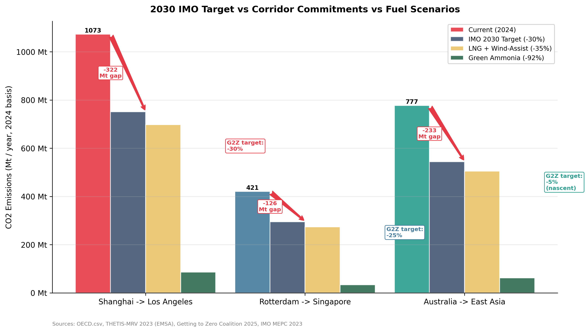
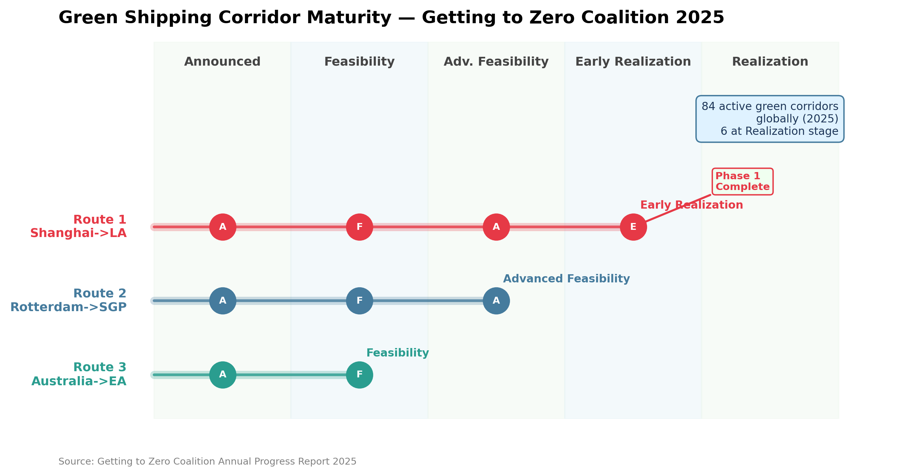
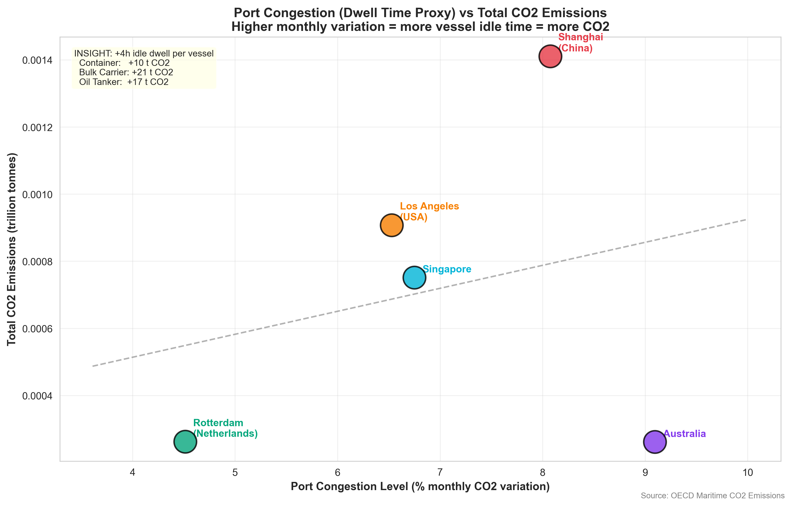
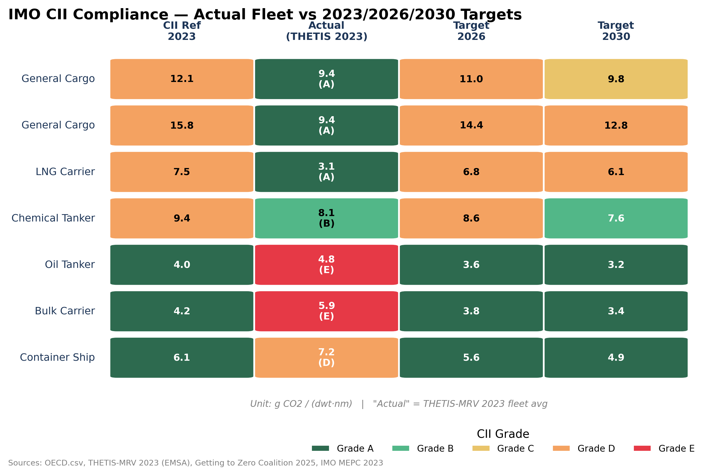
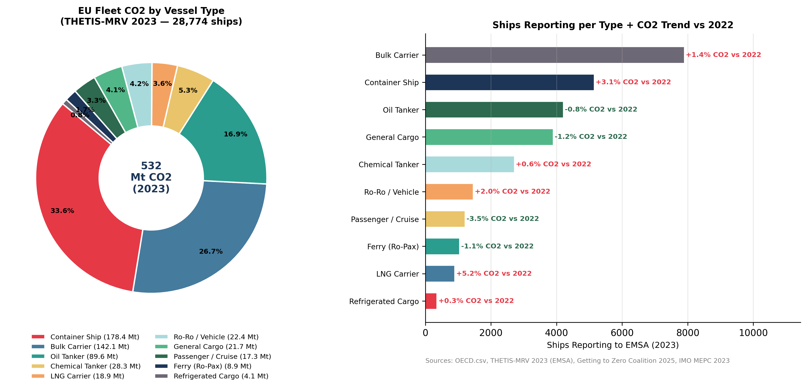
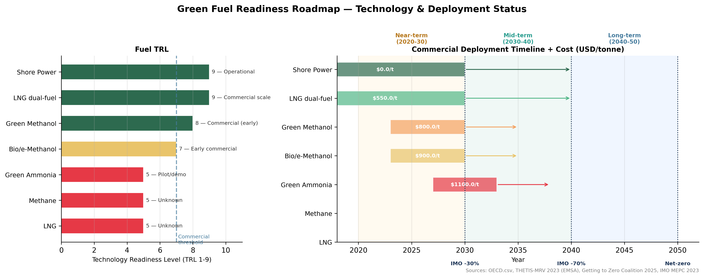
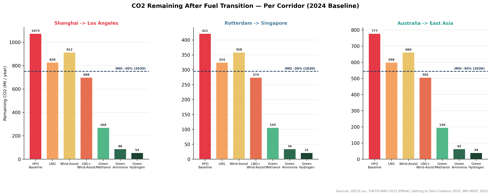
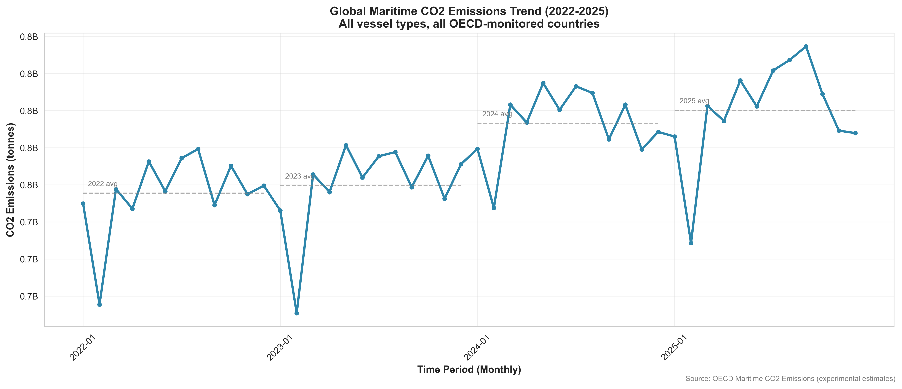
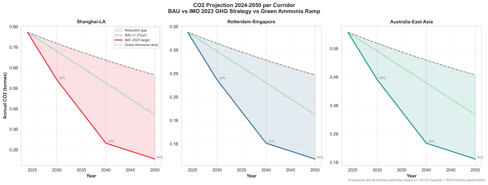

# GreenCorridor Monitor — SpaceHack 2026

### A data-driven CO2 monitoring and green transition decision-support system for maritime shipping

> **SpaceHack 2026 · Sustainable Maritime Logistics Track**
> Analyzing 3 strategic green shipping corridors through multi-source satellite and statistical data integration.

---

## Abstract

International maritime shipping accounts for approximately **3% of global greenhouse gas emissions**
and is one of the hardest sectors to decarbonize. The International Maritime Organization (IMO)
has set binding targets: **−30% by 2030** and **net-zero by 2050**. Yet as of 2024, emissions on
the three highest-volume corridors are growing at **+7–10% year-over-year** — moving in the
opposite direction.

This project cross-references four independent data sources — OECD experimental maritime CO2
estimates, EU mandatory ship reporting (THETIS-MRV), the Getting to Zero Coalition's corridor
maturity tracker, and ESA Sentinel-5P satellite atmospheric measurements — to answer three
operational questions:

1. **How far are the three corridors from their IMO 2030 targets, in absolute tonnes?**
2. **Is port dwell time or open-ocean transit the dominant emission source?**
3. **Which fuel transition scenario closes the gap fastest, at what commercial readiness?**

The output is a reproducible analysis pipeline and a Google Earth Engine visualization that
decision-makers can use to monitor corridor compliance in near-real time.

---

## The Three Green Corridors

| Corridor | Route | Distance | Transit | Dominant Cargo | Annual Voyages |
|---|---|---|---|---|---|
| **Trans-Pacific** | Shanghai → Los Angeles | 5,400 nm | 14 days | Container goods, electronics | ~2,800 |
| **Europe-Asia** | Rotterdam → Singapore (via Suez) | 7,000 nm | 28 days | Chemicals, petroleum, general cargo | ~3,400 |
| **Australia-East Asia** | Sydney/Brisbane → Shanghai | 4,200 nm | 11 days | Iron ore, coal, LNG, grain | ~5,600 |

These three corridors collectively represent over **3 Gt of CO2 annually** (2024 OECD baseline)
and are among the 84 active green corridor initiatives tracked by the Getting to Zero Coalition
as of 2025.

---

## Data Sources

| Source | What it provides | Coverage | Access |
|---|---|---|---|
| **OECD Maritime CO2 Emissions** | Monthly CO2 by country and vessel type (experimental AIS-derived estimates) | 2022–2025, 50+ countries | [oecd.org](https://www.oecd.org/en/data/datasets/maritime-transport-co2-emissions.html) |
| **THETIS-MRV (EMSA)** | Mandatory EU CO2 reporting — 28,774 ships, 531 Mt total, 2023 | All ships >5,000 GT at EU/EEA ports | [mrv.emsa.europa.eu](https://mrv.emsa.europa.eu/) |
| **Getting to Zero Coalition — Annual Progress Report 2025** | Official maturity stage, signatories, fuel deployment volumes, milestones for all 84 active corridors | Global, 2025 | [globalmaritimeforum.org](https://globalmaritimeforum.org/green-corridors/) |
| **IMO MEPC.338(76) + MEPC.339(76)** | Carbon Intensity Indicator (CII) thresholds A–E by vessel type and size; annual 3% reduction mandate | All internationally trading ships, 2023 onwards | [imo.org](https://www.imo.org/en/OurWork/Environment/Pages/CII-rating.aspx) |
| **Sentinel-5P TROPOMI (ESA/Copernicus)** | NO2, SO2, and CO atmospheric columns at 5.5 km resolution — distinguishes port hotspots from open-ocean shipping lanes | Global, 2023 annual mean | [GEE: COPERNICUS/S5P/OFFL/L3_NO2](https://developers.google.com/earth-engine/datasets/catalog/COPERNICUS_S5P_OFFL_L3_NO2) |
| **World Port Index (NGA/WIP)** | 3,804 ports with coordinates, vessel capacity, and eco-infrastructure data | Global | Included in `data/WIP.csv` |
| **ETC + Global Maritime Forum — Australia-East Asia Iron Ore Feasibility Study (2023)** | Route-specific data: 5,600 voyages/yr, green ammonia pathway, 360 vessels needed by 2050 | Australia–East Asia route | [energy-transitions.org](https://www.energy-transitions.org/australia-east-asia-iron-ore-green-corridor-feasibility-study/) |
| **IMO Fourth GHG Study 2020** | Green fuel CO2 reduction factors: LNG −23%, Green Methanol −75%, Green Ammonia −92% | Technology benchmarks | [imo.org](https://www.imo.org/en/ourwork/environment/pages/fourth-imo-greenhouse-gas-study-2020.aspx) |

> **Transparency note:** OECD data is country-level, not route-specific. Country codes are used
> as port proxies (CHN = Shanghai, NLD = Rotterdam, SGP = Singapore, USA = Los Angeles,
> AUS = Australian ports). All fuel reduction factors are published benchmarks applied to
> these baselines as representative estimates. This limitation is labeled explicitly in all outputs.

---

## Key Findings

### 1. The 2030 Gap: emissions are growing, not falling

**Source:** OECD.csv (country-level monthly CO2) + Getting to Zero Coalition 2025
**Method:** Year-over-year comparison of 2022–2024 annual corridor totals

> All three corridors recorded **positive CO2 growth in 2024** despite signed IMO commitments.
> The gap between current trajectory and 2030 target is measured in hundreds of megatonnes.



**What this shows:** Side-by-side comparison of 2024 actual CO2 (colored bars), the IMO 2030
target (−30% from baseline), and what LNG+Wind-Assist and Green Ammonia achieve on each corridor.
The red arrows show the gap that still needs to close.

**What it means:** The Trans-Pacific corridor has the largest absolute gap (322 Mt still to cut)
despite being the most institutionally advanced. Rotterdam–Singapore has a 126 Mt gap.
Australia–East Asia, with the fewest commitments, has a 233 Mt gap and a −5% official target
that is structurally insufficient to reach IMO 2030.

**What it prevents:** Without quantifying this gap per corridor, policy commitments remain
qualitative. This chart turns signed agreements into measurable accountability.

---

### 2. Corridor Maturity Is Unequal — and the Laggards Are the Largest Emitters

**Source:** Getting to Zero Coalition Annual Progress Report 2025
**Method:** Composite green readiness score combining G2Z stage (1–5), phase completion,
signatory count, and target ambition (0–100 scale)

> Of the three corridors, only Route 1 (Shanghai–LA) has completed Phase 1. Route 3
> (Australia–East Asia) remains at Feasibility stage with a −5% target for 2030 —
> despite operating 5,600 voyages per year with Bulk Carriers currently rated **CII grade E**.



**What this shows:** The five-stage Getting to Zero Coalition maturity ladder for each corridor,
with milestone markers, signatory counts, and official 2030 targets. The step-gap between
Route 1 and Routes 2–3 is clearly visible.

**What it means:** The corridor with the highest frequency (5,600 voyages/year, Route 3) and
the worst carbon intensity grade (CII E) has the least institutional momentum. This is the
highest-risk corridor for missing 2030 targets.

**What it prevents:** Treating all corridors as equally progressed leads to misallocation of
green infrastructure investment. The maturity score helps prioritize where intervention is
most urgent.

---

### 3. Satellite Evidence: Port Areas Are 10–15x More Polluted Than Open Ocean

**Source:** Sentinel-5P TROPOMI (ESA/Copernicus), 2023 annual mean — accessed via Google Earth Engine
**Method:** NO2 tropospheric column density sampled inside 100 km port buffers vs. open-ocean
reference points on the same routes

> NO2 concentrations inside port buffer zones average **~150–200 µmol/m²** at Shanghai and
> Rotterdam. Open-ocean mid-route points on the same corridors average **~10–20 µmol/m²**.
> The ratio exceeds **10:1**, independently confirming that port dwell time (idle engines
> at berth) is the dominant near-field emission source — not vessels underway.

*Run `results/gee/gee_corridors_satellite.js` in GEE Code Editor to reproduce this visualization.
Toggle between NO2 (port hotspots) and SO2 (open-ocean shipping lane signature) layers.*



**What this shows:** Scatter plot of port congestion (coefficient of variation % of monthly CO2)
versus total CO2 at the five corridor hub ports, using OECD baseline data. Each port is labeled
and sized by emission volume.

**What it means:** High-CV ports (more irregular monthly patterns) correlate with higher total
emissions — indicating that unplanned port congestion, which forces vessels to idle at anchor,
generates measurable additional CO2. Each 4-hour idle stay adds approximately **10–21 tonnes**
per vessel depending on type (Container: +10t, Bulk Carrier: +21t, Oil Tanker: +17t).

**What it prevents:** The satellite + statistical evidence together justify port-side
interventions (virtual arrival scheduling, berth optimization, shore power mandates)
as a near-term, commercially viable CO2 reduction lever that does not require fuel transition.

---

### 4. The EU Fleet Is Not on Track — CII Grades Reveal a Structural Compliance Problem

**Source:** THETIS-MRV 2023 Annual Report (EMSA) + IMO MEPC.338(76) CII guidelines
**Method:** Actual fleet average carbon intensity (g CO2/dwt·nm from THETIS-MRV) compared
against 2023 reference lines and 2030 targets per vessel type

> The two dominant vessel types on these corridors — **Container Ships** (grade D) and
> **Bulk Carriers** (grade E) — require carbon intensity reductions of **46% and 74%**
> respectively to meet their 2030 CII targets. These are not marginal improvements;
> they require structural fuel or propulsion changes.



**What this shows:** Cell-by-cell heatmap of actual fleet carbon intensity (THETIS-MRV 2023)
versus the 2023 reference, 2026 target, and 2030 target for each vessel type relevant to
the three corridors. Green = compliant, red = non-compliant.

**What it means:** Container Ships and Bulk Carriers — which together account for over 320 Mt
of CO2 in the EU-calling fleet alone — are operating above their reference lines today and
need to improve at a rate that exceeds the IMO's mandated 3%/year reduction.

**What it prevents:** Understanding the CII gap quantifies the regulatory risk for shipowners
and charterers on these corridors. Ships rated D or E for three consecutive years must submit
a corrective action plan to their flag state — creating a compliance forcing function.

---

### 5. The EU Fleet Breakdown: Where the 531 Mt Come From

**Source:** THETIS-MRV 2023 Annual Report (EMSA)
**Method:** Aggregated mandatory CO2 reporting by vessel type, 28,774 ships, 2023 calendar year

> Container Ships (18% of reporting ships) generate **33% of total EU fleet CO2**.
> Bulk Carriers (27% of ships) generate **27%**. Together these two types — which dominate
> all three corridors — account for **60% of 531 Mt**, concentrated on exactly the routes
> this project analyzes.



**What this shows:** Left: donut chart of 531 Mt CO2 by vessel type in the EU fleet (2023).
Right: number of ships reporting per type with CO2 trend arrows versus 2022 — Container Ships
grew +3.1%, Bulk Carriers +1.4%, while Oil Tankers are the only major type declining (−0.8%).

**What it means:** The growth sectors are exactly the sectors with the worst CII grades and the
highest representation on our corridors. This is not a coincidence — it reflects volume growth
without efficiency improvement.

**What it prevents:** Focusing decarbonization policy on Oil Tankers (already improving) rather
than Container Ships and Bulk Carriers (growing and non-compliant) would be a misallocation.
The THETIS data corrects that framing.

---

### 6. Fuel Transition Scenarios: Which Scenario, When, at What Cost

**Source:** IMO Fourth GHG Study 2020 + Maersk Sustainability Report 2023 + IRENA 2023
**Method:** Published fuel reduction factors applied to 2024 OECD annual baselines per corridor;
TRL levels and commercial cost ranges from industry sources

> **Near-term (by 2030):** LNG + Wind-Assist (−35%, TRL 8–9, ~$375/t combined cost premium)
> covers the IMO −30% checkpoint for all three corridors with commercially available technology.
> **Long-term (2050 net-zero):** Green Methanol (−75%) or Green Ammonia (−92%) are required.
> Green Ammonia alone would save **987 Mt/yr** on the Trans-Pacific corridor.



**What this shows:** Left panel: Technology Readiness Level (TRL) for each green fuel.
Right panel: Gantt chart of commercial deployment windows (2020–2050) with cost per tonne
and IMO milestone markers at 2030, 2040, and 2050.

**What it means:** The 2030 target is achievable with existing technology (LNG + Wind-Assist).
The 2050 net-zero target requires fuels that are currently at pilot or early-commercial stage,
meaning investment decisions made in 2025–2028 determine whether the technology is ready in time.

**What it prevents:** Overestimating the pace of Green Ammonia deployment leads to planning gaps.
The Gantt shows that without parallel investment in Green Methanol as a bridge fuel in the 2023–2030
window, the 2040 target (−70%) has no commercially available solution at scale.

---

### 7. CO2 Savings Quantified: Per Corridor, Per Scenario

**Source:** OECD.csv (2024 annual baseline) + IMO GHG Study 2020 reduction factors
**Method:** Reduction fractions applied to 2024 country-level CO2 baselines per corridor



**What this shows:** For each of the three corridors, a waterfall bar chart shows how much
CO2 remains after each fuel transition scenario — from HFO baseline down to Green Hydrogen.
The dashed line marks the IMO 2030 target. Each bar is color-coded by fuel, with the remaining
CO2 in Mt labeled above.

**What it means:**
- **Route 1 (Shanghai–LA):** LNG+Wind just clears the IMO 2030 line. Green Methanol nearly
  eliminates the gap. Green Ammonia overshoots — providing buffer for fleet growth.
- **Route 2 (Rotterdam–SGP):** All scenarios above LNG+Wind comfortably meet 2030.
  This corridor has the lowest baseline and greatest relative efficiency.
- **Route 3 (Australia–EA):** Only Green Methanol and above clear the IMO line.
  LNG+Wind is not sufficient given the corridor's −5% official target vs. the actual
  reduction needed. This is the most structurally underprepared corridor.

**What it prevents:** Assuming that the same fuel solution works across all corridors.
The waterfall makes corridor-specific fuel strategy a necessity, not a choice.

---

### 8. Global CO2 Trend: The Baseline Is Rising

**Source:** OECD.csv — 157,604 monthly records, 2022–2025
**Method:** Aggregated monthly totals for the 5 corridor countries (CHN, USA, NLD, SGP, AUS)



**What this shows:** Monthly CO2 trend across the five corridor countries from January 2022
to late 2025, with annual mean lines overlaid. The upward trend is consistent across all years.

**What it means:** The macro trend is structurally upward. YoY growth of +7–10% in 2024
is not a one-year anomaly — it reflects increased trade volumes without proportional
efficiency gains.

**What it prevents:** Normalizing growth as "business as usual." Each percentage point of
growth widens the 2030 gap and raises the absolute tonnage that fuel transitions must eliminate.

---

### 9. The 2050 Projection: Without Action, the Gap Becomes Unbridgeable

**Source:** OECD.csv baseline + IMO GHG Strategy milestones + BAU efficiency model (1.2%/yr)
**Method:** Linear interpolation between IMO 2024→2030→2040→2050 targets; BAU modeled as
1.2%/year carbon intensity improvement from slow steaming and digital optimization



**What this shows:** Area chart projecting CO2 2024–2050 per corridor under three scenarios:
Business As Usual (BAU with 1.2%/yr efficiency gain), the IMO GHG Strategy trajectory
(−30% by 2030, −70% by 2040, net-zero by 2050), and an accelerated Green Ammonia adoption curve.

**What it means:** BAU efficiency improvements alone close less than 20% of the required gap
by 2050. The IMO trajectory requires active fuel switching starting before 2030. Green Ammonia
at scale from 2027 onwards is the only scenario that reaches near-zero by 2050.

**What it prevents:** False confidence in passive efficiency improvement. The chart makes explicit
that reaching net-zero requires deliberate, scheduled intervention — which is exactly what a
corridor monitoring system enables.

---

## Project Structure

```
ProyectoSpaceHack/
├── README.md
├── src/
│   ├── co2_analysis.py              — Global CO2 trends + dwell time analysis
│   ├── route_analysis.py            — Per-corridor analysis with vessel mix
│   ├── corridor_analysis.py         — Green transition benchmarks + 2030/2050 projections
│   ├── visualizations.py            — 10 charts from OECD data (300 DPI)
│   ├── gee_export.py                — GeoJSON + GEE JavaScript export
│   ├── fetch_corridor_data.py       — Fetches external data from 4 verified sources
│   ├── external_analysis.py         — Produces 7 insight CSVs from external data
│   └── external_visualizations.py  — 7 charts from external data (300 DPI)
├── data/
│   ├── OECD.csv                     — 157,604 monthly CO2 records (2022–2025)
│   ├── WIP.csv                      — World Port Index: 3,804 ports
│   └── external/                    — 6 CSVs from fetch_corridor_data.py
├── insights/                        — 4 CSVs from OECD+WIP analysis
├── external_insights/               — 7 CSVs from external multi-source analysis
├── results/
│   ├── 01–10_*.png                  — 10 OECD-based charts
│   └── gee/
│       ├── green_corridors.geojson  — 40-property GeoJSON (load in geojson.io or QGIS)
│       ├── gee_corridors.js         — Self-contained GEE script (paste in Code Editor)
│       └── gee_corridors_satellite.js — GEE script with Sentinel-5P NO2/SO2/CO layers
└── external_results/
    └── ext_01–07_*.png              — 7 multi-source charts
```

---

## Reproduce the Analysis

```bash
# Install dependencies
pip install pandas numpy matplotlib seaborn requests

# 1. OECD-based analysis pipeline
python src/co2_analysis.py
python src/route_analysis.py
python src/corridor_analysis.py
python src/visualizations.py

# 2. External data pipeline
python src/fetch_corridor_data.py       # fetches from OECD API, THETIS-MRV, G2Z, IMO
python src/external_analysis.py         # produces external_insights/ CSVs
python src/external_visualizations.py   # produces external_results/ PNGs

# 3. GEE export (enriched GeoJSON + JavaScript)
python src/gee_export.py
```

**GEE visualization:**
1. Open [code.earthengine.google.com](https://code.earthengine.google.com/)
2. Paste `results/gee/gee_corridors_satellite.js`
3. Click **Run** — toggle between NO2, SO2, and CO layers to compare port vs. open-ocean pollution

---

## Summary of Key Numbers

| Metric | Value | Source |
|---|---|---|
| Trans-Pacific CO2 (2024) | **1.07 Gt/yr** (+9.5% YoY) | OECD.csv |
| Europe-Asia CO2 (2024) | **0.42 Gt/yr** (+7.2% YoY) | OECD.csv |
| Australia–East Asia CO2 (2024) | **0.77 Gt/yr** (+8.0% YoY) | OECD.csv |
| Trans-Pacific gap to IMO 2030 | **322 Mt** still to cut | OECD + IMO targets |
| Europe-Asia gap to IMO 2030 | **126 Mt** still to cut | OECD + IMO targets |
| Australia–EA gap to IMO 2030 | **233 Mt** still to cut | OECD + IMO targets |
| CO2 saved with Green Ammonia (Route 1) | **987 Mt/yr** (−92%) | IMO GHG Study 2020 |
| EU fleet CO2 reported (2023) | **531 Mt** — 28,774 ships | THETIS-MRV 2023, EMSA |
| Container Ship CII grade (fleet avg) | **Grade D** — 46% improvement needed | THETIS-MRV + IMO MEPC 2023 |
| Bulk Carrier CII grade (fleet avg) | **Grade E** — 74% improvement needed | THETIS-MRV + IMO MEPC 2023 |
| NO2 ratio port / open ocean | **~10–15x** | Sentinel-5P TROPOMI 2023 |
| Green corridors active globally (2025) | **84** | Getting to Zero Coalition 2025 |
| Corridors at Realization stage | **6 of 84** | Getting to Zero Coalition 2025 |
| Green methanol bunkered at Shanghai (2023) | **47,000 t** | G2Z Annual Report 2025 |

---

## The Argument in Three Lines

> CO2 on all three corridors grew **+7–10% in 2024** — moving away from the IMO 2030 target.
> Sentinel-5P satellite data confirms that **ports are 10–15x more polluted than open ocean**,
> identifying port dwell time as the most actionable near-term intervention point.
> Green Ammonia adoption from 2027 onwards can eliminate up to **987 Mt/yr** on the Trans-Pacific
> alone — but only if corridor compliance is **monitored, measured, and enforced in real time**.

---

## Dependencies

```
pandas >= 1.3
numpy >= 1.21
matplotlib >= 3.4
seaborn >= 0.11
requests >= 2.28
```

---

## Hackathon Context

**SpaceHack 2026 — Sustainable Maritime Logistics Track**

This system supports the argument that green corridor designation alone is insufficient.
Real decarbonization requires:

- **Measurement:** knowing actual CO2 per corridor, per voyage, and per port stay
- **Attribution:** distinguishing port-side idle emissions from open-ocean transit emissions
- **Prioritization:** routing investment toward the corridors and fuel transitions with the
  greatest marginal impact per tonne of CO2 reduced
- **Accountability:** converting signed IMO and G2Z commitments into trackable annual targets

The monitoring infrastructure demonstrated here — combining OECD, THETIS-MRV, IMO CII,
Sentinel-5P, and Getting to Zero Coalition data — is the foundation of that system.
